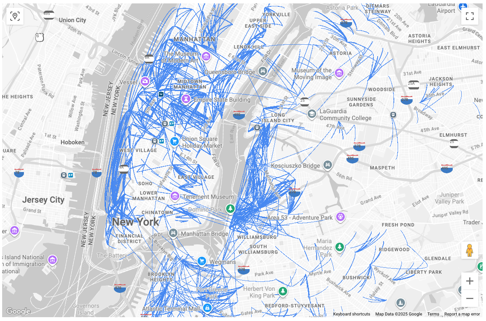
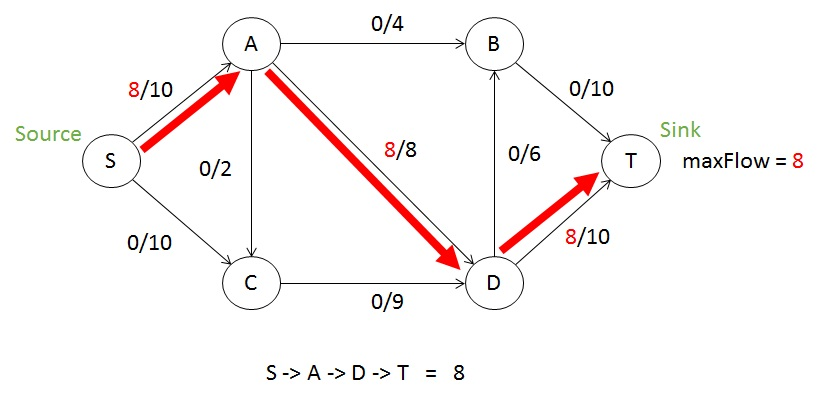
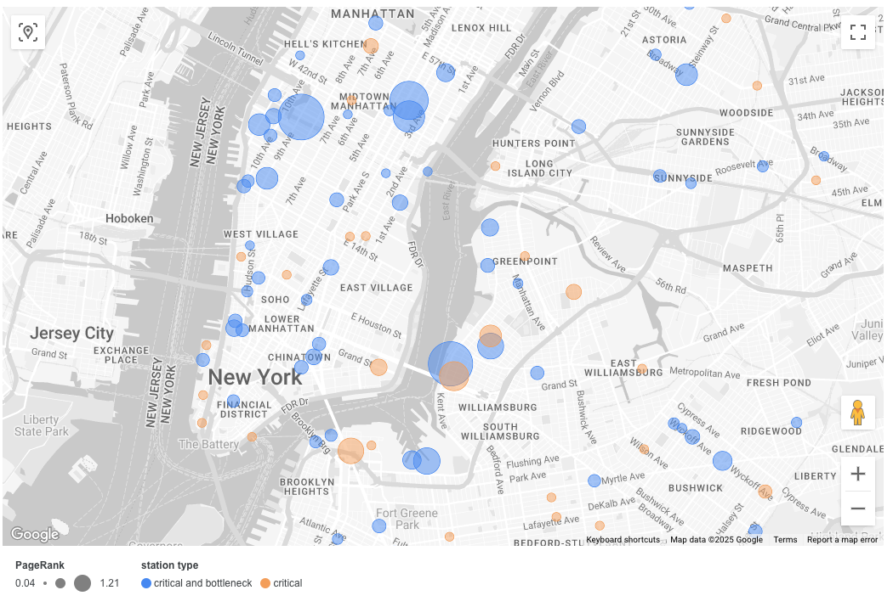

# Citibike Network Analysis Pipeline

## Overview

This is an analysis pipeline that consumes structured silver-layer data, processes it, and produces insights to optimize the Citibike network for morning commuters. Although, strictly speaking, this pipeline does not employ ML or AI models, it is similar to a training or inference pipeline because it reads from a more raw data source and performs computations that cannot be done in SQL or through a traditional data warehouse query engine.

The key steps of the pipeline are:
- Construct a "morning commute network" by filtering trips data for recent trips during morning commute times
- Identify the edges (one-way station-to-station trips) and nodes (stations) of this network
- Create a representation of this network as a max flow network
- Run max flow algorithms to identify critical stations and bottleneck stations in the network.
    - A **critical station** is a station where a decrease in capacity will decrease the maximum possible flow through the network.
    - A **bottleneck station** is a station where an increase in capacity will increase the maximum flow.
    - It is possible for the same station to fall in one, both, or neither of these categories.
- Calculate the importance of each critical / bottleneck node using network centrality metrics, most importantly PageRank.
- Write updated tables to BigQuery for the commute network edges, nodes (hubs), and the critical or bottleneck stations ordered by PageRank.

## Constructing the morning commute network

First, we take recent trip data (from the most recent 90 days of data) and filter it down to "commuter" trips. These are trips on weekdays with a start time from 7 - 11 a.m. We also filter out temporal outliers (trips shorter than 60 seconds or longer than one day) and trips that start and end at the same station. Finally, we count the number of trips along each `(start_station_id -> end_station_id)` pair in the filtered data, and we remove noise by only considering routes with over 100 total trips if starting in Manhattan, or otherwise more than 50 total trips.

This view of the data reveals a commuter network that is a subset of the overall Citibike network. It has many interesting characteristics:

- A relatively small number of stations (~800 out of 2,200+ total stations) and one-way routes (~1,600 out of millions of possible combinations, with a route from A to B considered different from a route from B to A)
- Large hubs centered around subway stations (like Bedford L or Penn Station), bike infrastructure (most notably the Hudson River Greenway), and to a lesser extent bridges
- Many stations (about 500) that have literally zero trips starting from them (purely destinations) or have literally zero trips ending at them (purely start points). An example of a "pure start point" station in the data is 3rd Street and Avenue D. An example of a "pure end point" station is Astor Place.
- Some massive "bidirectional" hubs (like Penn Station) that receive large flows of trips as a destination and a starting point

Here is a visualization of the routes in the morning commute network for the period of May - July 2025. The thicker the line, the more trips along this route. Note the formation of large hubs around Penn Station, the Bedford L stop in Brooklyn, and other places.

## The commuter network is a flow network

Many of these characteristics are found in **flow networks**. A flow network is a directed graph with a single source node (a node with no incoming edges), a single sink node (a node with no outgoing edges), and defined capacities for each edge. Flow networks are used to model real-world problems like Internet congestion, where the nodes are routers and the edge capacities are bandwidth limits of the physical links between routers. Oil or water pipelines are another example, where the size of the pipe constrains the flow from one junction to the next. A third example would be airline flight networks, where the number of available flights per day between different airports constrains the maximum number of people who can fly from, let's say, New York to Los Angeles on a given day. It is not surprising to see these characteristics in the commuter network. After all, an important use of Citibike is to help lots of people get from their homes to where they work, either by biking directly to their office or by biking to a subway to take to their office. This is a network with clear sources (start points) and sinks (destination points).

Using the station and trips data, we can model Citibike commuting as a flow network, and more specifically as a max flow problem that identifies the maximum possible throughput of bikes to destinations, given the capacities of stations in the network. We can then identify critical stations (stations where a decrease in capacity decreases the max flow) and bottleneck stations (stations where an increase in capacity would increase the max flow). Many stations are both critical and bottleneck stations, but they can also be only one, or neither.

Knowing which stations are critical or bottleneck stations in the recent data can help the people running Citibike plan their resources to help commuters. If a station is a critical station, a decrease in capacity will reduce the maximum possible flow of people through the network. This means that you want to make sure that all the docks work at a critical station. You might also want to use your rebalancing, bike valet, or Bike Angel teams to make sure that if a critical station has (let's say) 20 docks, then there are always 20 bikes ready to go (by moving bikes here from other places) and that there always 20 open docks for bikes (by having bike valets ready to take a bike from an arriving customer). In a similar way, these teams can be sent to bottleneck stations to actually increase the number of bikes available to grab or park, and in theory this would increase the overall throughput of the network.

I'm sure Citibike is already doing something like this, or already running a data-driven process of some kind to identify important stations and keep them stocked with bikes or help absorb incoming bikes. None of this analysis is meant as a disrespect to Citibike. It's just fun to look at the data and try to see if you can come to the same conclusions that they have.

## Constructing and transforming the graph representation

There is a standard algorithm for finding max flow in a flow network: the Edmonds-Karp algorithm, which runs in `O(nm^2)` time where `n` is the number of stations (nodes) and `m` is the number of distinct routes (edges). This algorithm produces a "residual graph" which shows exactly how much of each edge's capacity is used in order to maximize the flow from source to sink. The residual graph can then be used to identify critical edges and bottleneck edges. This is done by partitioning the residual graph in specific ways and finding edges that cross those partitions. The algorithms to find critical and bottleneck edges are common approaches found in many algorithms textbooks or papers.

The Citibike commuter network adds some wrinkles because there is not a single source or sink node as in a traditional flow network, but instead hundreds of each type. Also, we are not interested in critical and bottleneck edges but instead critical or bottleneck _nodes_ (stations). However, our representation of the network can be modified to work with the algorithm. First, we add to the graph a "super source" node which has an edge of infinite capacity to each of the actual source nodes in the network. In a similar way we add a "super sink" node which each of the actual sink nodes connects to with an edge of infinite capacity.  Next, to shift the focus from edge capacity to node capacity, we represent each node, let's say node `9 Ave & W 33`, as a pair of nodes, `9 Ave & W 33_in` and `9 Ave & W 33_out`, with a directed edge `(9 Ave & W 33_in -> 9 Ave & W 33_out)` whose capacity is equal to the capacity (number of docks) of the actual node. This means that all edges in the graph `(v -> w)` have to be represented as edges from `(v_out -> w_in)`. All of the approaches described in this paragraph are standard techniques when dealing with max flow problems.

With the graph constructed in this way, we can run Edmonds-Karp to get the residual graph, and then use that to find the subset of critical edges or bottleneck edges that go from `v_in` to `v_out` (as opposed to real edges that go from one station to a different station). These edges are not actual Citibike routes but just representations of a station's capacity. It follows that if an edge like this is a critical or bottleneck edge, then the station it represents can be considered a critical or bottleneck station. Why? Because decreasing or increasing the flow over some edge `(v_in -> v_out)` is exactly the same as decreasing or increasing the capacity of station `v`.

## Optimizing and prioritizing

Once we've identified critical and/or bottleneck stations, the most important question ought to be, "OK, so what, what do I do about it?" In fact, at the time of this writing the algorithm identifies 128 stations that are critical, bottlenecks, or both. That's a lot, so the information is useless unless we can give people some way to prioritize stations, or perhaps combinations of stations.

Finding the exact set of stations and capacity increases that will optimally maximize the flow in the network is a very challenging and computationally infeasible problem that is probably in the NP Complete or NP Hard class. Given some proposed solution (a set of stations and how much you want to increase their capacities), we can figure out in polynomial time exactly how much that solution will improve the max flow. We can do that by just running Edmonds-Karp again on this new hypothetical network. But there are an exponential number of possible improvement configurations and no clear way to efficiently search through them all for the best one. Even if there was a specific max flow target we wanted to reach, it would still take exponential time to find a configuration that met it. Furthermore, you also have to consider that changing the capacity of a station _will also change the behavior_ of the riders in the system which can result in a network with different nodes and edges.

Knowing this, instead of going down that rabbit hole, the pipeline enriches the data on these stations with some centrality metrics, in order to give a person looking at the data some ideas about which stations to prioritize. There are a number of well-known centrality metrics, all of which try to use characteristics about a node or the network to quantify how "important" a node is. For this project, it appears that the most useful centrality metric is PageRank. PageRank was the original Google algorithm, which calculated a website's importance based on the importance of the websites that linked to it, and so on. For Citibike, the idea is that a station is important if it has a lot of trips coming in from other important stations, and that _those_ stations also have lots of trips coming in from other important stations, and so on. Sorting the critical and/or bottleneck stations by PageRank in descending order, we get a top 10 list of vital stations that I think makes intuitive sense:

1. 9 Ave & W 33 St, Manhattan
2. S 2 St & Kent Ave, Brooklyn
3. E 47 St & Park Ave, Manhattan
4. E 44 St & Lexington Ave, Manhattan
5. Plaza St West & Flatbush Ave, Brooklyn
6. S 4 St & Wythe Ave, Brooklyn
7. Dock 72 Way & Market St, Brooklyn
8. N 6 St & Bedford Ave, Brooklyn
9. Jay St & York St, Brooklyn
10. Hanson Pl & Ashland Pl, Brooklyn

I believe this use of PageRank is very aligned with the original intent of the algorithm. Your Google search query produces a vast list of websites that match your query, and PageRank helps you prioritize which ones to visit first. Here, our max flow analysis produces a list of stations that you might want to look at, and PageRank helps you prioritize which ones to consider first.

This visualization shows the critical stations (in orange) and stations which are both critical and bottlenecks (in blue). (This data does not happen to have stations which are only bottlenecks, but it is possible.) The bigger the bubble, the higher the station's PageRank. In this visualization, the PageRank is multiplied by 100 for readability.

## Implementation

The standard pipeline architecture centered around dbt needs to be adapted for this type of analysis pipeline. Dbt is primarily a tool that constructs SQL queries which then need to be run on your data warehouse's compute layer. A data warehouse like BigQuery (used in this project) does have an additional feature, called `BigFrames`, which can work with dbt to allow a limited set of compute operations to be done on pandas-like data frames instead of traditional tables. However, most operations like model training and inference or, in this case, network analysis, will still not be suitable.

For this reason, the pipeline uses the BigQuery client to read the source tables into the memory of a separate Python process. This process does the network analysis, creates a pandas DataFrame to hold the results, and then writes the results to a BigQuery table.

When working with data at a much larger scale, this type of job would need to be offloaded to a container, or to another compute tool such as PySpark that can parallelize these operations and handle compute on data that cannot find into a single machine's working memory.

## Conclusion and next steps

Coming soon:

- These visualizations will be published on an online dashboard
- Additional metrics will be added to give a big-picture view of how well the commute network is functioning, for example seasonally-adjusted number of morning commute trips arriving at a sink station.

